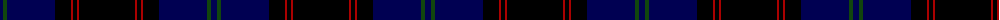

The parent of this is [Home](/tartans/db/6/dg4/db48/k16/dr2/k4/dr2/k/56/)

This was sourced from weddslist.  It is a [8 stripes tartan](/stripes/stripes8/).

Original link http://www.weddslist.com/cgi-bin/tartans/pg.pl?source=x

## Thread count
DB/6 DG4 DB48 K16 DR2 K4 DR2 K/56

## Palette
Each colour and its ΔE from the base-6 reference it is a variant of.

| Colour | Shade | Base | ΔE (OKLab) |
|---|---|---|---|
| DB |  `#000052` | B  | 0.20 |
| DG |  `#11450D` | G  | 0.10 |
| DR |  `#AA0000` | R  | 0.06 |
| K |  `#000000` | K  | 0.00 |

# Sample pattern

ID: /variants/db/6/dg4/db48/k16/dr2/k4/dr2/k/56-db000052-dg11450d-draa0000-k000000/
