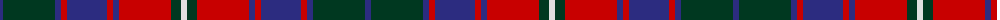

The parent of this is [Roxburgh Red District Tartan Tartan Number: 140. Earliest known date: 1875 Roxburgh is in the heart of the Borders region of Scotland. The pattern was taken from a silk in Patterson's sample book (c.1875) now stored in the Scottish Tartan Society's archives. The tartan may have been in production before 1850, and is now woven commercially for the first time in perhaps a century and a half. See products available Copyright © Blair Urquhart, Comrie, 2015](/tartans/db/6/dg52/db6/r6/db40/r6/db6/r52/dg10/ln/6/)

This was sourced from house-of-tartan.  It is a [10 stripes tartan](/stripes/stripes10/).

Original link http://www.house-of-tartan.scotland.net/house/TartanViewjs.asp?colr=Def&tnam=140

## Thread count
DB/6 DG52 DB6 R6 DB40 R6 DB6 R52 DG10 LN/6

## Palette
Each colour and its ΔE from the base-6 reference it is a variant of.

| Colour | Shade | Base | ΔE (OKLab) |
|---|---|---|---|
| DB |  `#2C2C80` | B  | 0.05 |
| DG |  `#003820` | G  | 0.16 |
| LN |  `#E0E0E0` | W  | 0.06 |
| R |  `#C80000` | R  | 0.00 |

ID: /variants/db/6/dg52/db6/r6/db40/r6/db6/r52/dg10/ln/6-db2c2c80-dg003820-lne0e0e0-rc80000/
