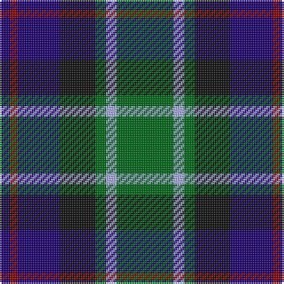

The parent of this is [MacLean, Donald (Personal)](/tartans/db/6/dr4/db24/k20/g6/lp6/g/32/)

This was sourced from tartans-authority.  It is a [7 stripes tartan](/stripes/stripes7/).

Original link http://www.tartansauthority.com/tartan-ferret/display/3440/

## Thread count
DB/6 DR4 DB24 K20 G6 LP6 G/32

## Palette
Each colour and its ΔE from the base-6 reference it is a variant of.

| Colour | Shade | Base | ΔE (OKLab) |
|---|---|---|---|
| DB |  `#1C0070` | B  | 0.14 |
| DR |  `#880000` | R  | 0.14 |
| G |  `#006818` | G  | 0.02 |
| K |  `#101010` | K  | 0.17 |
| LP |  `#A8ACE8` | W  | 0.22 |

# Sample pattern

ID: /variants/db/6/dr4/db24/k20/g6/lp6/g/32-db1c0070-dr880000-g006818-k101010-lpa8ace8/
