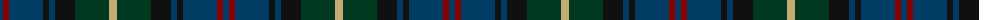
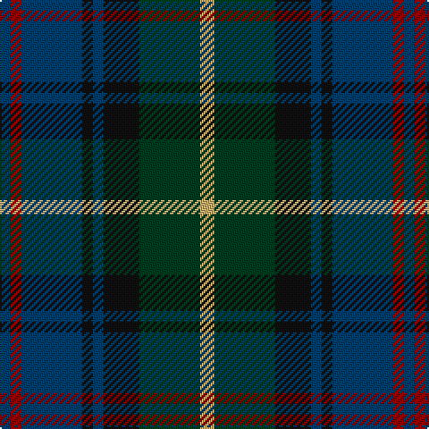

The parent of this is [Royal Highland Society (Corporate)](/tartans/db/6/dr6/db34/k6/db6/k20/dg34/lg/8/)

This was sourced from tartans-authority.  It is a [8 stripes tartan](/stripes/stripes8/).

Original link http://www.tartansauthority.com/tartan-ferret/display/2054/

## Thread count
DB/6 DR6 DB34 K6 DB6 K20 DG34 LG/8

## Palette
Each colour and its ΔE from the base-6 reference it is a variant of.

| Colour | Shade | Base | ΔE (OKLab) |
|---|---|---|---|
| DB |  `#003C64` | B  | 0.07 |
| DG |  `#003820` | G  | 0.16 |
| DR |  `#880000` | R  | 0.14 |
| K |  `#101010` | K  | 0.17 |
| LG |  `#C4AC74` | Y  | 0.11 |

# Sample pattern

ID: /variants/db/6/dr6/db34/k6/db6/k20/dg34/lg/8-db003c64-dg003820-dr880000-k101010-lgc4ac74/
