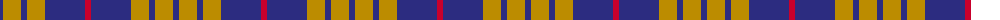

The parent of this is [Latin (Artefact)](/tartans/db/6/dy18/db6/dy18/db40/r/6/)

This was sourced from tartans-authority.  It is a [6 stripes tartan](/stripes/stripes6/).

Original link http://www.tartansauthority.com/tartan-ferret/display/3873/

## Thread count
DB/6 DY18 DB6 DY18 DB40 R/6

## Palette
Each colour and its ΔE from the base-6 reference it is a variant of.

| Colour | Shade | Base | ΔE (OKLab) |
|---|---|---|---|
| DB |  `#2C2C80` | B  | 0.05 |
| DY |  `#BC8C00` | Y  | 0.16 |
| R |  `#C8002C` | R  | 0.03 |

# Sample pattern

ID: /variants/db/6/dy18/db6/dy18/db40/r/6-db2c2c80-dybc8c00-rc8002c/
