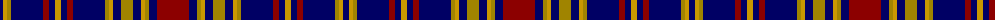

The parent of this is [Longniddry](/tartans/db/6/dy4/lg4/db32/dr6/db6/dy6/db6/dr6/db32/lg4/dy4/db8/lg12/db8/dy4/lg4/db8/dr/32/)

This was sourced from register-of-tartans.  It is a [19 stripes tartan](/stripes/stripes19/).

Original link https://www.tartanregister.gov.uk/tartanDetails.aspx?ref=2204

## Thread count
DB/6 DY4 LG4 DB32 DR6 DB6 DY6 DB6 DR6 DB32 LG4 DY4 DB8 LG12 DB8 DY4 LG4 DB8 DR/32

## Palette
Each colour and its ΔE from the base-6 reference it is a variant of.

| Colour | Shade | Base | ΔE (OKLab) |
|---|---|---|---|
| DB |  `#000064` | B  | 0.17 |
| DR |  `#8C0000` | R  | 0.13 |
| DY |  `#C89800` | Y  | 0.12 |
| LG |  `#A08400` | Y  | 0.20 |

ID: /variants/db/6/dy4/lg4/db32/dr6/db6/dy6/db6/dr6/db32/lg4/dy4/db8/lg12/db8/dy4/lg4/db8/dr/32-db000064-dr8c0000-dyc89800-lga08400/
