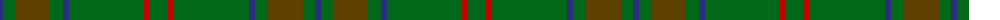

The parent of this is [Glenlivet Corporate Tartan Tartan Number: 193. Earliest known date: 1989 Designed for Glenlivet Distilleries Ltd, Strathspey. See products available Copyright © Blair Urquhart, Comrie, 2015](/tartans/db/6/g12/t35/g13/db6/g75/r6/g/18/)

This was sourced from house-of-tartan.  It is a [8 stripes tartan](/stripes/stripes8/).

Original link http://www.house-of-tartan.scotland.net/house/TartanViewjs.asp?colr=Def&tnam=193

## Thread count
DB/6 G12 T35 G13 DB6 G75 R6 G/18

## Palette
Each colour and its ΔE from the base-6 reference it is a variant of.

| Colour | Shade | Base | ΔE (OKLab) |
|---|---|---|---|
| DB |  `#2C2C80` | B  | 0.05 |
| G |  `#006818` | G  | 0.02 |
| R |  `#C80000` | R  | 0.00 |
| T |  `#604000` | G  | 0.14 |

# Sample pattern

ID: /variants/db/6/g12/t35/g13/db6/g75/r6/g/18-db2c2c80-g006818-rc80000-t604000/
