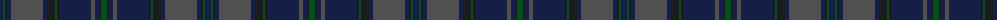

The parent of this is [Tiger of Sweden](/tartans/db/6/g2/k2/db4/n32/db4/k8/g2/k2/db32/n4/db4/k2/g/6/)

This was sourced from register-of-tartans.  It is a [14 stripes tartan](/stripes/stripes14/).

Original link https://www.tartanregister.gov.uk/tartanDetails.aspx?ref=10870

## Thread count
DB/6 G2 K2 DB4 N32 DB4 K8 G2 K2 DB32 N4 DB4 K2 G/6

## Palette
Each colour and its ΔE from the base-6 reference it is a variant of.

| Colour | Shade | Base | ΔE (OKLab) |
|---|---|---|---|
| DB |  `#141E46` | B  | 0.15 |
| G |  `#005020` | G  | 0.08 |
| K |  `#1C1C1C` | B  | 0.20 |
| N |  `#505050` | B  | 0.12 |

ID: /variants/db/6/g2/k2/db4/n32/db4/k8/g2/k2/db32/n4/db4/k2/g/6-db141e46-g005020-k1c1c1c-n505050/
