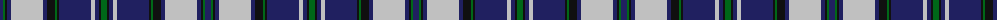

The parent of this is [Tiger of Sweden](/tartans/db/6/g2/k2/db4/n32/db4/k8/g2/k2/db32/n4/db4/k2/g/6/)

This was sourced from tartans-authority.  It is a [14 stripes tartan](/stripes/stripes14/).

Original link http://www.tartansauthority.com/tartan-ferret/display/10870/

## Thread count
DB/6 G2 K2 DB4 N32 DB4 K8 G2 K2 DB32 N4 DB4 K2 G/6

## Palette
Each colour and its ΔE from the base-6 reference it is a variant of.

| Colour | Shade | Base | ΔE (OKLab) |
|---|---|---|---|
| DB |  `#202060` | B  | 0.11 |
| G |  `#006818` | G  | 0.02 |
| K |  `#101010` | K  | 0.17 |
| N |  `#C0C0C0` | W  | 0.16 |

ID: /variants/db/6/g2/k2/db4/n32/db4/k8/g2/k2/db32/n4/db4/k2/g/6-db202060-g006818-k101010-nc0c0c0/
