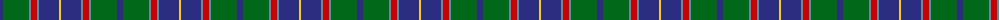

The parent of this is [Heckenberg Htg (Personal)](/tartans/db/6/g26/b2/r6/b2/db20/y/2/)

This was sourced from tartans-authority.  It is a [7 stripes tartan](/stripes/stripes7/).

Original link http://www.tartansauthority.com/tartan-ferret/display/10637/

## Thread count
DB/6 G26 B2 R6 B2 DB20 Y/2

## Palette
Each colour and its ΔE from the base-6 reference it is a variant of.

| Colour | Shade | Base | ΔE (OKLab) |
|---|---|---|---|
| B |  `#5C8CA8` | B  | 0.23 |
| DB |  `#2C2C80` | B  | 0.05 |
| G |  `#006818` | G  | 0.02 |
| R |  `#C80000` | R  | 0.00 |
| Y |  `#FCCC00` | Y  | 0.04 |

# Sample pattern

ID: /variants/db/6/g26/b2/r6/b2/db20/y/2-b5c8ca8-db2c2c80-g006818-rc80000-yfccc00/
