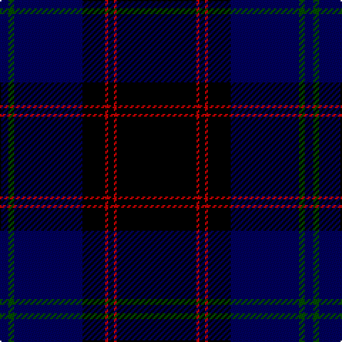

The parent of this is [Home](/tartans/db/6/g4/db48/k16/r2/k4/r2/k/56/)

This was sourced from weddslist.  It is a [8 stripes tartan](/stripes/stripes8/).

Original link http://www.weddslist.com/cgi-bin/tartans/pg.pl?source=rb

## Thread count
DB/6 G4 DB48 K16 R2 K4 R2 K/56

## Palette
Each colour and its ΔE from the base-6 reference it is a variant of.

| Colour | Shade | Base | ΔE (OKLab) |
|---|---|---|---|
| DB |  `#00005C` | B  | 0.18 |
| G |  `#004C00` | G  | 0.08 |
| K |  `#000000` | K  | 0.00 |
| R |  `#C80000` | R  | 0.00 |

# Sample pattern

ID: /variants/db/6/g4/db48/k16/r2/k4/r2/k/56-db00005c-g004c00-k000000-rc80000/
