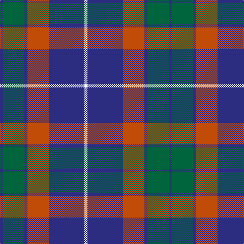

The parent of this is [Donnolly (Fashion)](/tartans/db/6/g42/db6/do42/db70/w/6/)

This was sourced from tartans-authority.  It is a [6 stripes tartan](/stripes/stripes6/).

Original link http://www.tartansauthority.com/tartan-ferret/display/6034/

## Thread count
DB/6 G42 DB6 DO42 DB70 W/6

## Palette
Each colour and its ΔE from the base-6 reference it is a variant of.

| Colour | Shade | Base | ΔE (OKLab) |
|---|---|---|---|
| DB |  `#2C2C80` | B  | 0.05 |
| DO |  `#C04C08` | R  | 0.08 |
| G |  `#00643C` | G  | 0.06 |
| W |  `#FCFCFC` | W  | 0.03 |

# Sample pattern

ID: /variants/db/6/g42/db6/do42/db70/w/6-db2c2c80-doc04c08-g00643c-wfcfcfc/
