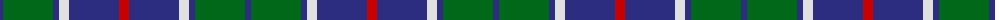
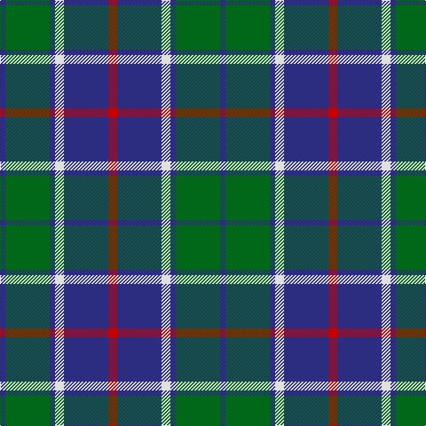

The parent of this is [Thayer USA (Name)](/tartans/db/6/g50/db6/ln10/db50/r/10/)

This was sourced from tartans-authority.  It is a [6 stripes tartan](/stripes/stripes6/).

Original link http://www.tartansauthority.com/tartan-ferret/display/10150/

## Thread count
DB/6 G50 DB6 LN10 DB50 R/10

## Palette
Each colour and its ΔE from the base-6 reference it is a variant of.

| Colour | Shade | Base | ΔE (OKLab) |
|---|---|---|---|
| DB |  `#2C2C80` | B  | 0.05 |
| G |  `#006818` | G  | 0.02 |
| LN |  `#E0E0E0` | W  | 0.06 |
| R |  `#C80000` | R  | 0.00 |

# Sample pattern

ID: /variants/db/6/g50/db6/ln10/db50/r/10-db2c2c80-g006818-lne0e0e0-rc80000/
