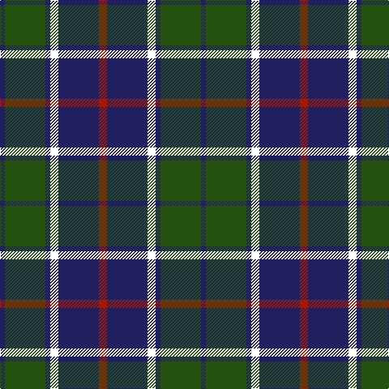

The parent of this is [Thayer USA](/tartans/db/6/g50/db6/w10/db50/dr/10/)

This was sourced from register-of-tartans.  It is a [6 stripes tartan](/stripes/stripes6/).

Original link https://www.tartanregister.gov.uk/tartanDetails.aspx?ref=10150

## Thread count
DB/6 G50 DB6 W10 DB50 DR/10

## Palette
Each colour and its ΔE from the base-6 reference it is a variant of.

| Colour | Shade | Base | ΔE (OKLab) |
|---|---|---|---|
| DB |  `#202060` | B  | 0.11 |
| DR |  `#A51805` | R  | 0.07 |
| G |  `#255210` | G  | 0.06 |
| W |  `#FFFFFF` | W  | 0.03 |

# Sample pattern

ID: /variants/db/6/g50/db6/w10/db50/dr/10-db202060-dra51805-g255210-wffffff/
