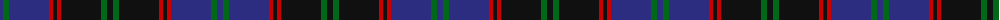

The parent of this is [Hume or Home Clan Tartan Tartan Number: 125. Earliest known date: pre 2003 Alternate spelling for Home. See products available Copyright © Blair Urquhart, Comrie, 2015](/tartans/db/6/g6/db40/r4/k4/r4/k40/g6/k/6/)

This was sourced from house-of-tartan.  It is a [9 stripes tartan](/stripes/stripes9/).

Original link http://www.house-of-tartan.scotland.net/house/TartanViewjs.asp?colr=Def&tnam=125

## Thread count
DB/6 G6 DB40 R4 K4 R4 K40 G6 K/6

## Palette
Each colour and its ΔE from the base-6 reference it is a variant of.

| Colour | Shade | Base | ΔE (OKLab) |
|---|---|---|---|
| DB |  `#2C2C80` | B  | 0.05 |
| G |  `#006818` | G  | 0.02 |
| K |  `#101010` | K  | 0.17 |
| R |  `#C80000` | R  | 0.00 |

ID: /variants/db/6/g6/db40/r4/k4/r4/k40/g6/k/6-db2c2c80-g006818-k101010-rc80000/
