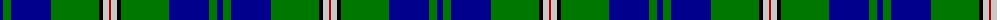
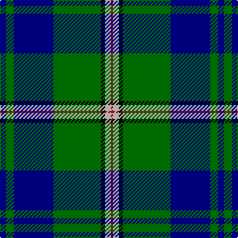

The parent of this is [Nowell/Noel (Name)](/tartans/db/6/g8/db40/g48/k4/n6/dr/2/)

This was sourced from tartans-authority.  It is a [7 stripes tartan](/stripes/stripes7/).

Original link http://www.tartansauthority.com/tartan-ferret/display/4108/

## Thread count
DB/6 G8 DB40 G48 K4 N6 DR/2

## Palette
Each colour and its ΔE from the base-6 reference it is a variant of.

| Colour | Shade | Base | ΔE (OKLab) |
|---|---|---|---|
| DB |  `#00008C` | B  | 0.13 |
| DR |  `#B00000` | R  | 0.05 |
| G |  `#007800` | G  | 0.06 |
| K |  `#000000` | K  | 0.00 |
| N |  `#C8C8C8` | W  | 0.13 |

# Sample pattern

ID: /variants/db/6/g8/db40/g48/k4/n6/dr/2-db00008c-drb00000-g007800-k000000-nc8c8c8/
