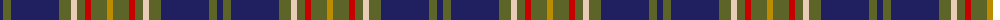

The parent of this is [Scottish Borders Tourist Board (Corp](/tartans/db/6/g8/db48/g12/lr6/g8/r6/g16/dy/6/)

This was sourced from tartans-authority.  It is a [9 stripes tartan](/stripes/stripes9/).

Original link http://www.tartansauthority.com/tartan-ferret/display/4040/

## Thread count
DB/6 G8 DB48 G12 LR6 G8 R6 G16 DY/6

## Palette
Each colour and its ΔE from the base-6 reference it is a variant of.

| Colour | Shade | Base | ΔE (OKLab) |
|---|---|---|---|
| DB |  `#202060` | B  | 0.11 |
| DY |  `#BC8C00` | Y  | 0.16 |
| G |  `#5C6428` | G  | 0.09 |
| LR |  `#E8CCB8` | W  | 0.11 |
| R |  `#C80000` | R  | 0.00 |

ID: /variants/db/6/g8/db48/g12/lr6/g8/r6/g16/dy/6-db202060-dybc8c00-g5c6428-lre8ccb8-rc80000/
