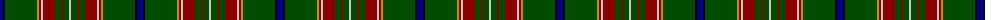

The parent of this is [Canadian Caledonian Htg (Universal)](/tartans/db/6/k2/g32/dy2/dr2/n2/dr12/g6/dr2/g6/n/2/)

This was sourced from tartans-authority.  It is a [11 stripes tartan](/stripes/stripes11/).

Original link http://www.tartansauthority.com/tartan-ferret/display/335/

## Thread count
DB/6 K2 G32 DY2 DR2 N2 DR12 G6 DR2 G6 N/2

## Palette
Each colour and its ΔE from the base-6 reference it is a variant of.

| Colour | Shade | Base | ΔE (OKLab) |
|---|---|---|---|
| DB |  `#00008C` | B  | 0.13 |
| DR |  `#8C0000` | R  | 0.13 |
| DY |  `#C88C00` | Y  | 0.15 |
| G |  `#004C00` | G  | 0.08 |
| K |  `#000000` | K  | 0.00 |
| N |  `#C8C8C8` | W  | 0.13 |

ID: /variants/db/6/k2/g32/dy2/dr2/n2/dr12/g6/dr2/g6/n/2-db00008c-dr8c0000-dyc88c00-g004c00-k000000-nc8c8c8/
