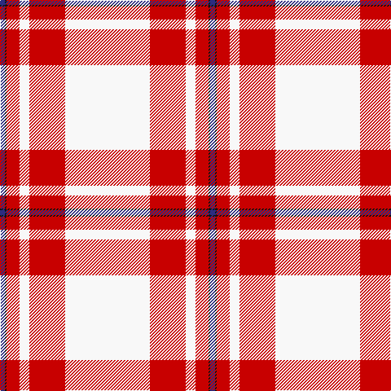

The parent of this is [MacGregor - 1975 (Dance, Red)](/tartans/db/6/k2/r16/w12/r44/w/104/)

This was sourced from tartans-authority.  It is a [6 stripes tartan](/stripes/stripes6/).

Original link http://www.tartansauthority.com/tartan-ferret/display/6541/

## Thread count
DB/6 K2 R16 W12 R44 W/104

## Palette
Each colour and its ΔE from the base-6 reference it is a variant of.

| Colour | Shade | Base | ΔE (OKLab) |
|---|---|---|---|
| DB |  `#2C2C80` | B  | 0.05 |
| K |  `#101010` | K  | 0.17 |
| R |  `#C80000` | R  | 0.00 |
| W |  `#F8F8F8` | W  | 0.01 |

# Sample pattern

ID: /variants/db/6/k2/r16/w12/r44/w/104-db2c2c80-k101010-rc80000-wf8f8f8/
