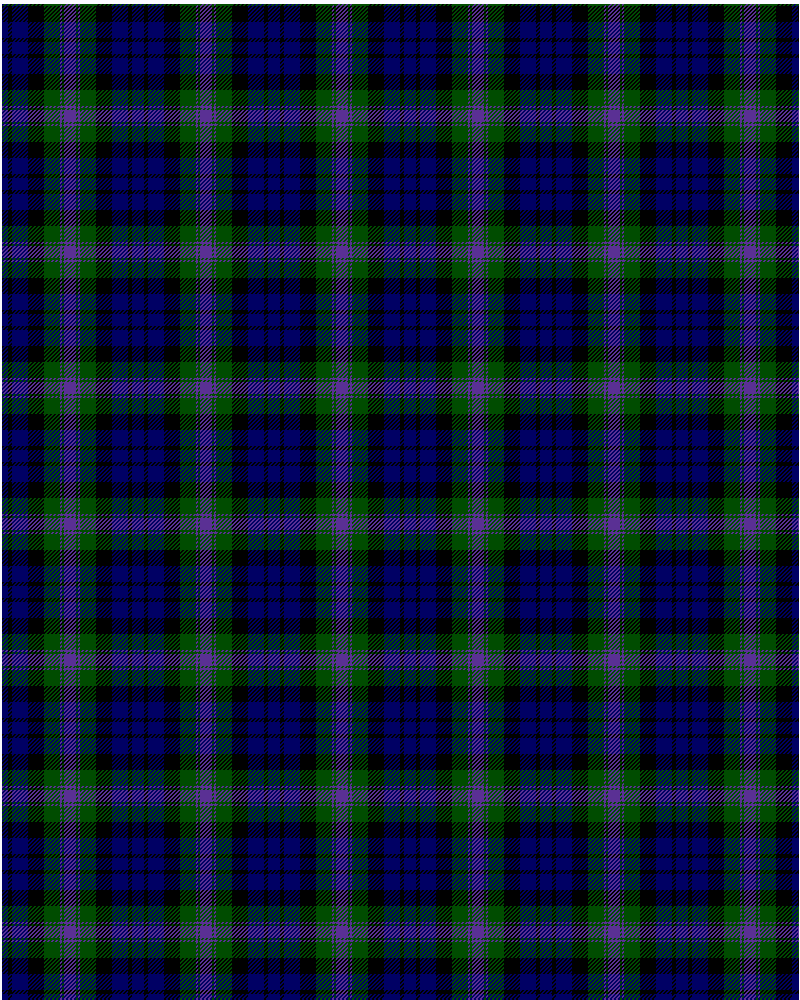

The parent of this is [Baird](/tartans/db/6/k4/db16/k16/g16/p2/g2/p/6/)

This was sourced from <no value>.  It is a [8 stripes tartan](/stripes/stripes8/).

Original link http://www.weddslist.com/cgi-bin/tartans/pg.pl?source=rb

## Thread count
DB/6 K4 DB16 K16 G16 P2 G2 P/6

## Palette
DB G K P

# Sample pattern

ID: /variants/db/6/k4/db16/k16/g16/p2/g2/p/6-db000064-g004c00-k000000-p5a3094/