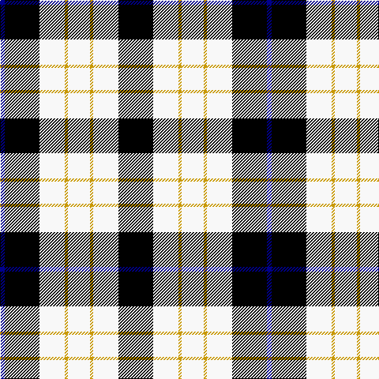

The parent of this is [Kennison](/tartans/db/6/k44/w32/dy4/w28/dy4/w32/k/44/)

This was sourced from register-of-tartans.  It is a [8 stripes tartan](/stripes/stripes8/).

Original link https://www.tartanregister.gov.uk/tartanDetails.aspx?ref=1948

## Thread count
DB/6 K44 W32 DY4 W28 DY4 W32 K/44

## Palette
Each colour and its ΔE from the base-6 reference it is a variant of.

| Colour | Shade | Base | ΔE (OKLab) |
|---|---|---|---|
| DB |  `#00008C` | B  | 0.13 |
| DY |  `#C89800` | Y  | 0.12 |
| K |  `#000000` | K  | 0.00 |
| N |  `#B0B0B0` | Y  | 0.18 |
| W |  `#F8F8F8` | W  | 0.01 |

# Sample pattern

ID: /variants/db/6/k44/w32/dy4/w28/dy4/w32/k/44-db00008c-dyc89800-k000000-nb0b0b0-wf8f8f8/
