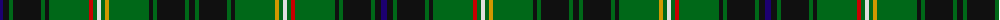

The parent of this is [Lorne Asymmetric (Artefact)](/tartans/db/6/k6/g4/k28/g4/k4/g40/r4/g4/ln4/g4/dy4/g40/k4/g4/k28/g4/k/6/)

This was sourced from tartans-authority.  It is a [18 stripes tartan](/stripes/stripes18/).

Original link http://www.tartansauthority.com/tartan-ferret/display/1978/

## Thread count
DB/6 K6 G4 K28 G4 K4 G40 R4 G4 LN4 G4 DY4 G40 K4 G4 K28 G4 K/6

## Palette
Each colour and its ΔE from the base-6 reference it is a variant of.

| Colour | Shade | Base | ΔE (OKLab) |
|---|---|---|---|
| DB |  `#1C0070` | B  | 0.14 |
| DY |  `#D09800` | Y  | 0.11 |
| G |  `#006818` | G  | 0.02 |
| K |  `#101010` | K  | 0.17 |
| LN |  `#E0E0E0` | W  | 0.06 |
| R |  `#C80000` | R  | 0.00 |

ID: /variants/db/6/k6/g4/k28/g4/k4/g40/r4/g4/ln4/g4/dy4/g40/k4/g4/k28/g4/k/6-db1c0070-dyd09800-g006818-k101010-lne0e0e0-rc80000/
