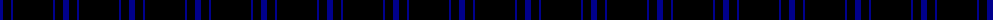
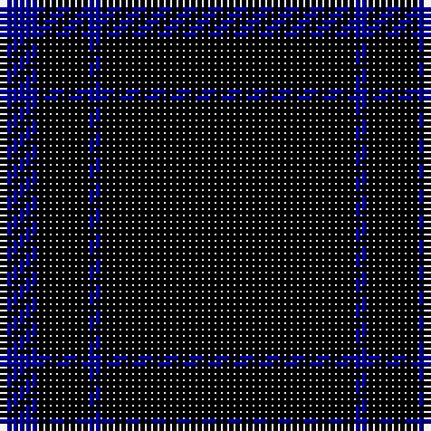

The parent of this is [Loevenstein Castle 2 (Artefact)](/tartans/db/6/k8/db2/k/40/)

This was sourced from tartans-authority.  It is a [4 stripes tartan](/stripes/stripes4/).

Original link http://www.tartansauthority.com/tartan-ferret/display/3633/

## Thread count
DB/6 K8 DB2 K/40

## Palette
Each colour and its ΔE from the base-6 reference it is a variant of.

| Colour | Shade | Base | ΔE (OKLab) |
|---|---|---|---|
| DB |  `#00008C` | B  | 0.13 |
| K |  `#000000` | K  | 0.00 |

# Sample pattern

ID: /variants/db/6/k8/db2/k/40-db00008c-k000000/
