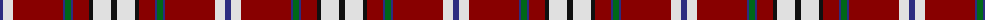

The parent of this is [Bro-Zol (Corporate)](/tartans/db/6/ln10/dr50/db2/g6/db2/dr16/k4/ln18/k/6/)

This was sourced from tartans-authority.  It is a [10 stripes tartan](/stripes/stripes10/).

Original link http://www.tartansauthority.com/tartan-ferret/display/6647/

## Thread count
DB/6 LN10 DR50 DB2 G6 DB2 DR16 K4 LN18 K/6

## Palette
Each colour and its ΔE from the base-6 reference it is a variant of.

| Colour | Shade | Base | ΔE (OKLab) |
|---|---|---|---|
| DB |  `#2C2C80` | B  | 0.05 |
| DR |  `#880000` | R  | 0.14 |
| G |  `#006818` | G  | 0.02 |
| K |  `#101010` | K  | 0.17 |
| LN |  `#E0E0E0` | W  | 0.06 |

ID: /variants/db/6/ln10/dr50/db2/g6/db2/dr16/k4/ln18/k/6-db2c2c80-dr880000-g006818-k101010-lne0e0e0/
