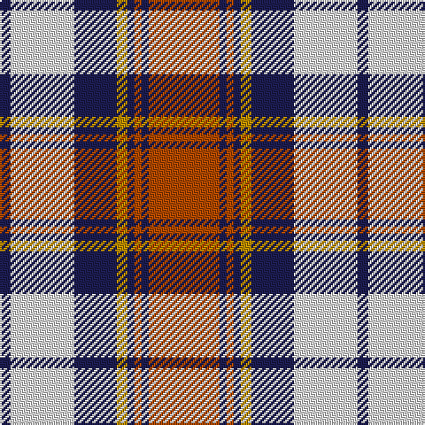

The parent of this is [Heriot](/tartans/db/6/ln36/db24/dy6/db4/do4/db4/do/40/)

This was sourced from register-of-tartans.  It is a [8 stripes tartan](/stripes/stripes8/).

Original link https://www.tartanregister.gov.uk/tartanDetails.aspx?ref=1692

## Thread count
DB/6 LN36 DB24 DY6 DB4 DO4 DB4 DO/40

## Palette
Each colour and its ΔE from the base-6 reference it is a variant of.

| Colour | Shade | Base | ΔE (OKLab) |
|---|---|---|---|
| DB |  `#1C1C50` | B  | 0.14 |
| DO |  `#B04800` | R  | 0.08 |
| DY |  `#BC8C00` | Y  | 0.16 |
| LN |  `#E0E0E0` | W  | 0.06 |
| LT |  `#A08858` | Y  | 0.21 |

# Sample pattern

ID: /variants/db/6/ln36/db24/dy6/db4/do4/db4/do/40-db1c1c50-dob04800-dybc8c00-lne0e0e0-lta08858/
