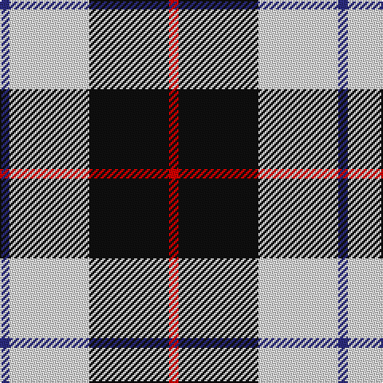

The parent of this is [Gleneckley](/tartans/db/6/ln50/k50/r/6/)

This was sourced from register-of-tartans.  It is a [4 stripes tartan](/stripes/stripes4/).

Original link https://www.tartanregister.gov.uk/tartanDetails.aspx?ref=11038

## Thread count
DB/6 LN50 K50 R/6

## Palette
Each colour and its ΔE from the base-6 reference it is a variant of.

| Colour | Shade | Base | ΔE (OKLab) |
|---|---|---|---|
| DB |  `#2C2C80` | B  | 0.05 |
| K |  `#101010` | K  | 0.17 |
| LN |  `#E0E0E0` | W  | 0.06 |
| R |  `#DC0000` | R  | 0.04 |

# Sample pattern

ID: /variants/db/6/ln50/k50/r/6-db2c2c80-k101010-lne0e0e0-rdc0000/
