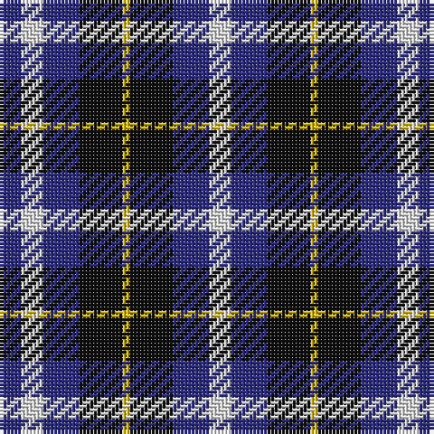

The parent of this is [Kilmarnock Football Club (Old)](/tartans/db/6/ln6/db10/k12/y2/k12/db10/ln/6/)

This was sourced from register-of-tartans.  It is a [8 stripes tartan](/stripes/stripes8/).

Original link https://www.tartanregister.gov.uk/tartanDetails.aspx?ref=1975

## Thread count
DB/6 LN6 DB10 K12 Y2 K12 DB10 LN/6

## Palette
Each colour and its ΔE from the base-6 reference it is a variant of.

| Colour | Shade | Base | ΔE (OKLab) |
|---|---|---|---|
| B |  `#3850C8` | B  | 0.12 |
| DB |  `#2C2C80` | B  | 0.05 |
| K |  `#101010` | K  | 0.17 |
| LN |  `#E0E0E0` | W  | 0.06 |
| Y |  `#E8C000` | Y  | 0.00 |

# Sample pattern

ID: /variants/db/6/ln6/db10/k12/y2/k12/db10/ln/6-b3850c8-db2c2c80-k101010-lne0e0e0-ye8c000/
