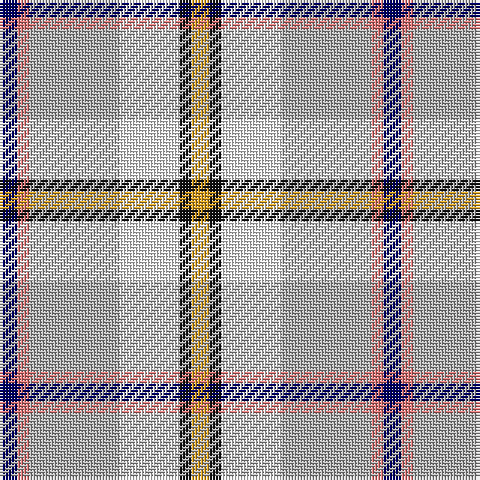

The parent of this is [SCH '67 Class](/tartans/db/6/lr4/n30/w20/k4/y/6/)

This was sourced from register-of-tartans.  It is a [6 stripes tartan](/stripes/stripes6/).

Original link https://www.tartanregister.gov.uk/tartanDetails.aspx?ref=11534

## Thread count
DB/6 LR4 N30 W20 K4 Y/6

## Palette
Each colour and its ΔE from the base-6 reference it is a variant of.

| Colour | Shade | Base | ΔE (OKLab) |
|---|---|---|---|
| DB |  `#000064` | B  | 0.17 |
| K |  `#101010` | K  | 0.17 |
| LR |  `#E87878` | R  | 0.19 |
| N |  `#B0B0B0` | Y  | 0.18 |
| W |  `#FFFFFF` | W  | 0.03 |
| Y |  `#E0A126` | Y  | 0.08 |

# Sample pattern

ID: /variants/db/6/lr4/n30/w20/k4/y/6-db000064-k101010-lre87878-nb0b0b0-wffffff-ye0a126/
