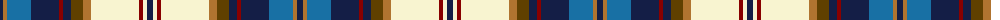

The parent of this is [Lashbrooke of Barrowfield (Personal)](/tartans/db/6/lt4/b24/db28/dr4/db8/t12/lt8/ly48/dr4/ly4/db/6/)

This was sourced from register-of-tartans.  It is a [12 stripes tartan](/stripes/stripes12/).

Original link https://www.tartanregister.gov.uk/tartanDetails.aspx?ref=10947

## Thread count
DB/6 LT4 B24 DB28 DR4 DB8 T12 LT8 LY48 DR4 LY4 DB/6

## Palette
Each colour and its ΔE from the base-6 reference it is a variant of.

| Colour | Shade | Base | ΔE (OKLab) |
|---|---|---|---|
| B |  `#1870A4` | B  | 0.14 |
| DB |  `#141E46` | B  | 0.15 |
| DR |  `#880000` | R  | 0.14 |
| LT |  `#B07430` | R  | 0.17 |
| LY |  `#F8F4D0` | W  | 0.04 |
| T |  `#604000` | G  | 0.14 |

ID: /variants/db/6/lt4/b24/db28/dr4/db8/t12/lt8/ly48/dr4/ly4/db/6-b1870a4-db141e46-dr880000-ltb07430-lyf8f4d0-t604000/
