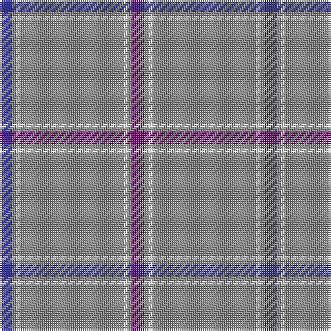

The parent of this is [St. Giles Check (Corporate)](/tartans/db/6/n2/w2/n50/w2/n2/p/6/)

This was sourced from tartans-authority.  It is a [7 stripes tartan](/stripes/stripes7/).

Original link http://www.tartansauthority.com/tartan-ferret/display/387/

## Thread count
DB/6 N2 W2 N50 W2 N2 P/6

## Palette
Each colour and its ΔE from the base-6 reference it is a variant of.

| Colour | Shade | Base | ΔE (OKLab) |
|---|---|---|---|
| DB |  `#2C2C80` | B  | 0.05 |
| N |  `#888888` | R  | 0.24 |
| P |  `#780078` | B  | 0.16 |
| W |  `#FCFCFC` | W  | 0.03 |

# Sample pattern

ID: /variants/db/6/n2/w2/n50/w2/n2/p/6-db2c2c80-n888888-p780078-wfcfcfc/
