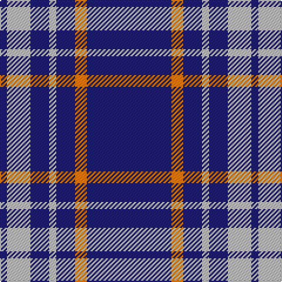

The parent of this is [Scottish Qualifications Auth. (Corp)](/tartans/db/6/n20/db16/n6/db16/o10/db/72/)

This was sourced from tartans-authority.  It is a [7 stripes tartan](/stripes/stripes7/).

Original link http://www.tartansauthority.com/tartan-ferret/display/2442/

## Thread count
DB/6 N20 DB16 N6 DB16 O10 DB/72

## Palette
Each colour and its ΔE from the base-6 reference it is a variant of.

| Colour | Shade | Base | ΔE (OKLab) |
|---|---|---|---|
| DB |  `#202060` | B  | 0.11 |
| N |  `#C0C0C0` | W  | 0.16 |
| O |  `#D87C00` | Y  | 0.17 |

# Sample pattern

ID: /variants/db/6/n20/db16/n6/db16/o10/db/72-db202060-nc0c0c0-od87c00/
