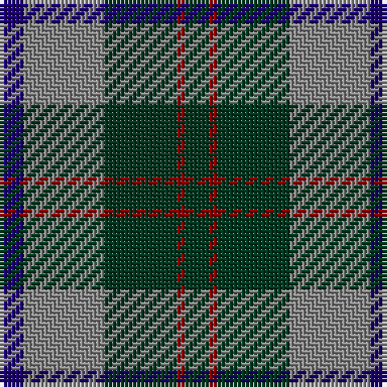

The parent of this is [Bethlehem, City of](/tartans/db/6/n20/dg18/dr2/dg/6/)

This was sourced from register-of-tartans.  It is a [5 stripes tartan](/stripes/stripes5/).

Original link https://www.tartanregister.gov.uk/tartanDetails.aspx?ref=4988

## Thread count
DB/6 N20 DG18 DR2 DG/6

## Palette
Each colour and its ΔE from the base-6 reference it is a variant of.

| Colour | Shade | Base | ΔE (OKLab) |
|---|---|---|---|
| DB |  `#1C0070` | B  | 0.14 |
| DG |  `#003820` | G  | 0.16 |
| DR |  `#880000` | R  | 0.14 |
| N |  `#888888` | R  | 0.24 |

# Sample pattern

ID: /variants/db/6/n20/dg18/dr2/dg/6-db1c0070-dg003820-dr880000-n888888/
