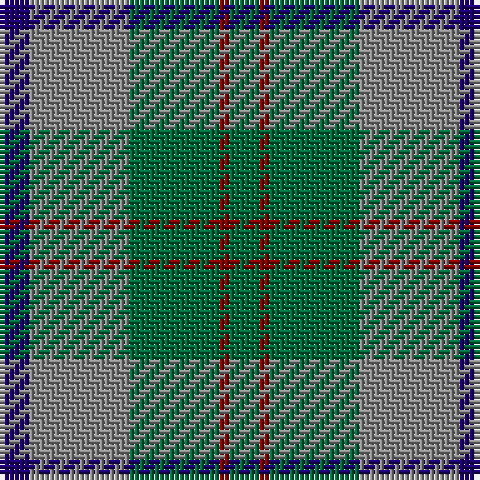

The parent of this is [Bethlehem, City of (District)](/tartans/db/6/n20/g18/dr2/g/6/)

This was sourced from tartans-authority.  It is a [5 stripes tartan](/stripes/stripes5/).

Original link http://www.tartansauthority.com/tartan-ferret/display/3263/

## Thread count
DB/6 N20 G18 DR2 G/6

## Palette
Each colour and its ΔE from the base-6 reference it is a variant of.

| Colour | Shade | Base | ΔE (OKLab) |
|---|---|---|---|
| DB |  `#1C0070` | B  | 0.14 |
| DR |  `#880000` | R  | 0.14 |
| G |  `#006C3C` | G  | 0.05 |
| N |  `#888888` | R  | 0.24 |

# Sample pattern

ID: /variants/db/6/n20/g18/dr2/g/6-db1c0070-dr880000-g006c3c-n888888/
