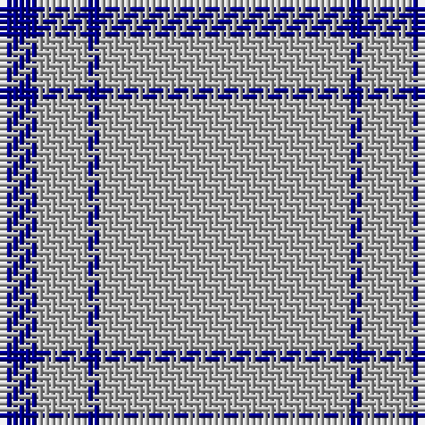

The parent of this is [Loevenstein Castle #2](/tartans/db/6/n8/db2/n/40/)

This was sourced from register-of-tartans.  It is a [4 stripes tartan](/stripes/stripes4/).

Original link https://www.tartanregister.gov.uk/tartanDetails.aspx?ref=4937

## Thread count
DB/6 N8 DB2 N/40

## Palette
Each colour and its ΔE from the base-6 reference it is a variant of.

| Colour | Shade | Base | ΔE (OKLab) |
|---|---|---|---|
| DB |  `#00008C` | B  | 0.13 |
| N |  `#B0B0B0` | Y  | 0.18 |

# Sample pattern

ID: /variants/db/6/n8/db2/n/40-db00008c-nb0b0b0/
