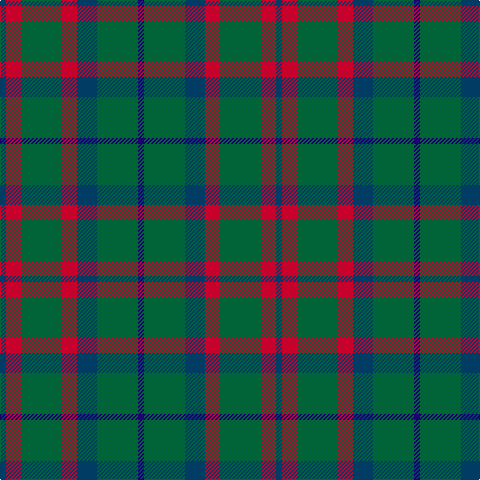

The parent of this is [Bean of Freeport Htg (Corporate)](/tartans/db/6/r15/g41/r15/db20/g41/dba/6/)

This was sourced from tartans-authority.  It is a [7 stripes tartan](/stripes/stripes7/).

Original link http://www.tartansauthority.com/tartan-ferret/display/106/

## Thread count
DB/6 R15 G41 R15 DB20 G41 DBa/6

## Palette
Each colour and its ΔE from the base-6 reference it is a variant of.

| Colour | Shade | Base | ΔE (OKLab) |
|---|---|---|---|
| DB |  `#003C64` | B  | 0.07 |
| DBa |  `#1C0070` | B  | 0.14 |
| G |  `#006438` | G  | 0.05 |
| R |  `#C8002C` | R  | 0.03 |

# Sample pattern

ID: /variants/db/6/r15/g41/r15/db20/g41/dba/6-db003c64-dba1c0070-g006438-rc8002c/
