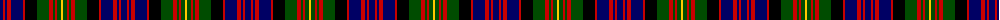

The parent of this is [Carnegie](/tartans/db/6/r2/db2/r4/db12/r2/k12/g12/r4/g2/r2/g4/y/2/)

This was sourced from weddslist.  It is a [13 stripes tartan](/stripes/stripes13/).

Original link http://www.weddslist.com/cgi-bin/tartans/pg.pl?source=rb

## Thread count
DB/6 R2 DB2 R4 DB12 R2 K12 G12 R4 G2 R2 G4 Y/2

## Palette
Each colour and its ΔE from the base-6 reference it is a variant of.

| Colour | Shade | Base | ΔE (OKLab) |
|---|---|---|---|
| DB |  `#000064` | B  | 0.17 |
| G |  `#004C00` | G  | 0.08 |
| K |  `#000000` | K  | 0.00 |
| R |  `#C80000` | R  | 0.00 |
| Y |  `#FFC800` | Y  | 0.04 |

ID: /variants/db/6/r2/db2/r4/db12/r2/k12/g12/r4/g2/r2/g4/y/2-db000064-g004c00-k000000-rc80000-yffc800/
