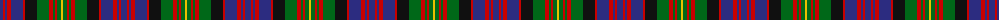

The parent of this is [Carnegie Family Tartan Tartan Number: 489. Earliest known date: c. 1715 A variant of the MacDonell of Glengarry said to have been adopted by Lord Southesk who was active in the 1715 rebellion. The Glengarry white becomes yellow in the Carnegie. It is possible that this minor difference was caused by the passage of time. See products available Copyright © Blair Urquhart, Comrie, 2015](/tartans/db/6/r2/db2/r4/db12/r2/k12/g12/r4/g2/r2/g4/y/2/)

This was sourced from house-of-tartan.  It is a [13 stripes tartan](/stripes/stripes13/).

Original link http://www.house-of-tartan.scotland.net/house/TartanViewjs.asp?colr=Def&tnam=489

## Thread count
DB/6 R2 DB2 R4 DB12 R2 K12 G12 R4 G2 R2 G4 Y/2

## Palette
Each colour and its ΔE from the base-6 reference it is a variant of.

| Colour | Shade | Base | ΔE (OKLab) |
|---|---|---|---|
| DB |  `#2C2C80` | B  | 0.05 |
| G |  `#006818` | G  | 0.02 |
| K |  `#101010` | K  | 0.17 |
| R |  `#C80000` | R  | 0.00 |
| Y |  `#E8C000` | Y  | 0.00 |

ID: /variants/db/6/r2/db2/r4/db12/r2/k12/g12/r4/g2/r2/g4/y/2-db2c2c80-g006818-k101010-rc80000-ye8c000/
