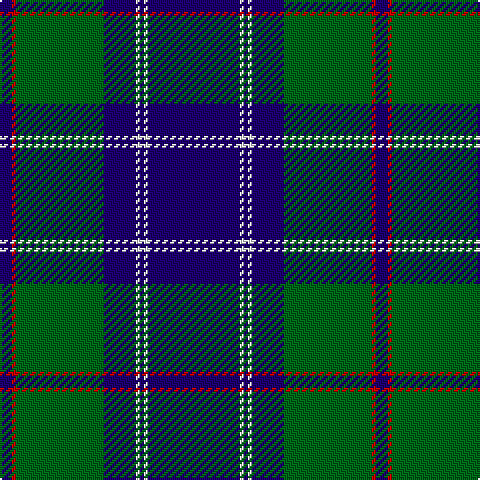

The parent of this is [Roxburgh, Green (District)](/tartans/db/6/r2/g44/db16/w2/db2/w2/db/46/)

This was sourced from tartans-authority.  It is a [8 stripes tartan](/stripes/stripes8/).

Original link http://www.tartansauthority.com/tartan-ferret/display/500/

## Thread count
DB/6 R2 G44 DB16 W2 DB2 W2 DB/46

## Palette
Each colour and its ΔE from the base-6 reference it is a variant of.

| Colour | Shade | Base | ΔE (OKLab) |
|---|---|---|---|
| DB |  `#1C0070` | B  | 0.14 |
| G |  `#006818` | G  | 0.02 |
| R |  `#C80000` | R  | 0.00 |
| W |  `#F8F8F8` | W  | 0.01 |

# Sample pattern

ID: /variants/db/6/r2/g44/db16/w2/db2/w2/db/46-db1c0070-g006818-rc80000-wf8f8f8/
