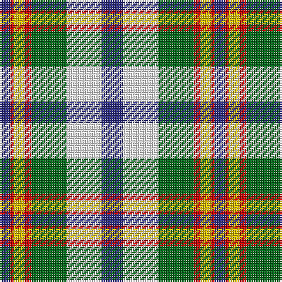

The parent of this is [Ainslie, Lake](/tartans/db/6/r2/y6/r4/g20/w20/db/12/)

This was sourced from register-of-tartans.  It is a [7 stripes tartan](/stripes/stripes7/).

Original link https://www.tartanregister.gov.uk/tartanDetails.aspx?ref=30

## Thread count
DB/6 R2 Y6 R4 G20 W20 DB/12

## Palette
Each colour and its ΔE from the base-6 reference it is a variant of.

| Colour | Shade | Base | ΔE (OKLab) |
|---|---|---|---|
| DB |  `#2C2C80` | B  | 0.05 |
| G |  `#006818` | G  | 0.02 |
| R |  `#C80000` | R  | 0.00 |
| W |  `#FCFCFC` | W  | 0.03 |
| Y |  `#E8C000` | Y  | 0.00 |

# Sample pattern

ID: /variants/db/6/r2/y6/r4/g20/w20/db/12-db2c2c80-g006818-rc80000-wfcfcfc-ye8c000/
