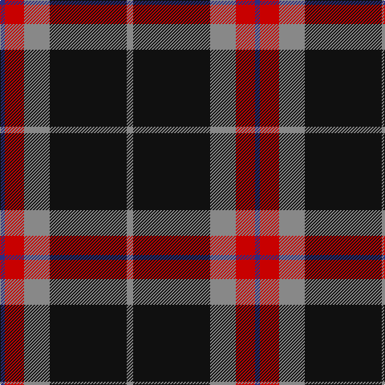

The parent of this is [Calgary Firefighters (Corporate)](/tartans/db/6/r24/n32/k96/n/8/)

This was sourced from tartans-authority.  It is a [5 stripes tartan](/stripes/stripes5/).

Original link http://www.tartansauthority.com/tartan-ferret/display/10484/

## Thread count
DB/6 R24 N32 K96 N/8

## Palette
Each colour and its ΔE from the base-6 reference it is a variant of.

| Colour | Shade | Base | ΔE (OKLab) |
|---|---|---|---|
| DB |  `#2C2C80` | B  | 0.05 |
| K |  `#101010` | K  | 0.17 |
| N |  `#888888` | R  | 0.24 |
| R |  `#C80000` | R  | 0.00 |

# Sample pattern

ID: /variants/db/6/r24/n32/k96/n/8-db2c2c80-k101010-n888888-rc80000/
