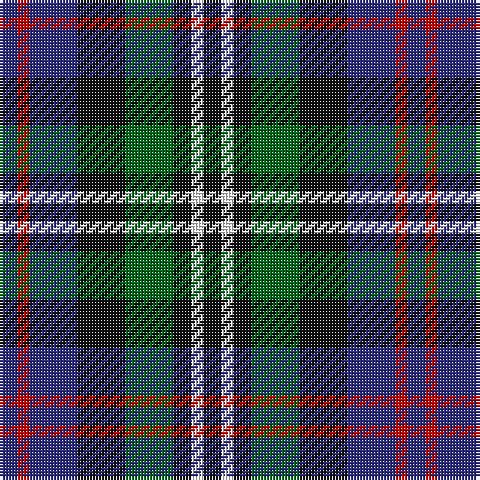

The parent of this is [Davidson 'Double' - 1847 (Clan)](/tartans/db/6/r4/db16/k16/g16/k6/w4/k/6/)

This was sourced from tartans-authority.  It is a [8 stripes tartan](/stripes/stripes8/).

Original link http://www.tartansauthority.com/tartan-ferret/display/444/

## Thread count
DB/6 R4 DB16 K16 G16 K6 W4 K/6

## Palette
Each colour and its ΔE from the base-6 reference it is a variant of.

| Colour | Shade | Base | ΔE (OKLab) |
|---|---|---|---|
| DB |  `#2C2C80` | B  | 0.05 |
| G |  `#006818` | G  | 0.02 |
| K |  `#101010` | K  | 0.17 |
| R |  `#C80000` | R  | 0.00 |
| W |  `#FCFCFC` | W  | 0.03 |

# Sample pattern

ID: /variants/db/6/r4/db16/k16/g16/k6/w4/k/6-db2c2c80-g006818-k101010-rc80000-wfcfcfc/
