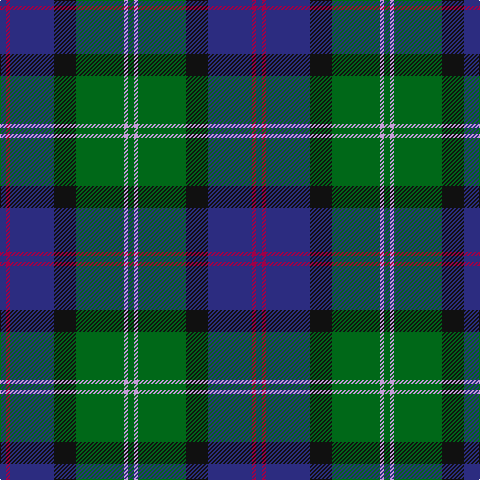

The parent of this is [MacThomas Clan Tartan Tartan Number: 407. Earliest known date: 1975 Designed by David Thomas - former director of the Strathmore Woollen Co. in Forfar who still (in 2011) weave this tartan. Adopted by Clan Society in 1975, and registered with Lord Lyon in 1979. See products available Copyright © Blair Urquhart, Comrie, 2015](/tartans/db/6/r4/db44/k22/g48/lp4/g/6/)

This was sourced from house-of-tartan.  It is a [7 stripes tartan](/stripes/stripes7/).

Original link http://www.house-of-tartan.scotland.net/house/TartanViewjs.asp?colr=Def&tnam=407

## Thread count
DB/6 R4 DB44 K22 G48 LP4 G/6

## Palette
Each colour and its ΔE from the base-6 reference it is a variant of.

| Colour | Shade | Base | ΔE (OKLab) |
|---|---|---|---|
| DB |  `#2C2C80` | B  | 0.05 |
| G |  `#006818` | G  | 0.02 |
| K |  `#101010` | K  | 0.17 |
| LP |  `#C49CD8` | W  | 0.24 |
| R |  `#A00048` | R  | 0.11 |

# Sample pattern

ID: /variants/db/6/r4/db44/k22/g48/lp4/g/6-db2c2c80-g006818-k101010-lpc49cd8-ra00048/
