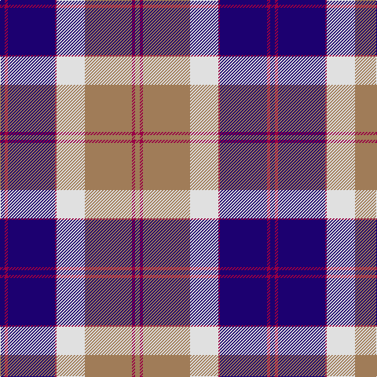

The parent of this is [Bannockbane Navy](/tartans/db/6/r4/db60/r2/ln36/lt60/r4/lt/6/)

This was sourced from register-of-tartans.  It is a [8 stripes tartan](/stripes/stripes8/).

Original link https://www.tartanregister.gov.uk/tartanDetails.aspx?ref=5045

## Thread count
DB/6 R4 DB60 R2 LN36 LT60 R4 LT/6

## Palette
Each colour and its ΔE from the base-6 reference it is a variant of.

| Colour | Shade | Base | ΔE (OKLab) |
|---|---|---|---|
| DB |  `#1C0070` | B  | 0.14 |
| LN |  `#E0E0E0` | W  | 0.06 |
| LT |  `#A07C58` | R  | 0.19 |
| R |  `#980044` | R  | 0.12 |

# Sample pattern

ID: /variants/db/6/r4/db60/r2/ln36/lt60/r4/lt/6-db1c0070-lne0e0e0-lta07c58-r980044/
