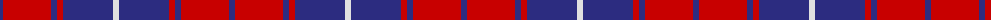

The parent of this is [Matthews Clan Tartan Tartan Number: 7003. Earliest known date: 2006 September A variant of the Donnachaidh (Robertson) tartan and reflects the Matthews family membership of that clan. Can be worn by all of the name. See products available Copyright © Blair Urquhart, Comrie, 2015](/tartans/db/6/r48/db6/r6/db50/ln/6/)

This was sourced from house-of-tartan.  It is a [6 stripes tartan](/stripes/stripes6/).

Original link http://www.house-of-tartan.scotland.net/house/TartanViewjs.asp?colr=Def&tnam=7003

## Thread count
DB/6 R48 DB6 R6 DB50 LN/6

## Palette
Each colour and its ΔE from the base-6 reference it is a variant of.

| Colour | Shade | Base | ΔE (OKLab) |
|---|---|---|---|
| DB |  `#2C2C80` | B  | 0.05 |
| LN |  `#E0E0E0` | W  | 0.06 |
| R |  `#C80000` | R  | 0.00 |

# Sample pattern

ID: /variants/db/6/r48/db6/r6/db50/ln/6-db2c2c80-lne0e0e0-rc80000/
