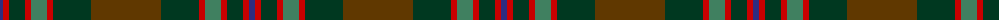

The parent of this is [John Muir Way](/tartans/db/6/r6/dg16/r6/g16/r6/dg38/t/70/)

This was sourced from tartans-authority.  It is a [8 stripes tartan](/stripes/stripes8/).

Original link http://www.tartansauthority.com/tartan-ferret/display/11022/

## Thread count
DB/6 R6 DG16 R6 G16 R6 DG38 T/70

## Palette
Each colour and its ΔE from the base-6 reference it is a variant of.

| Colour | Shade | Base | ΔE (OKLab) |
|---|---|---|---|
| DB |  `#2C2C80` | B  | 0.05 |
| DG |  `#003820` | G  | 0.16 |
| G |  `#408060` | G  | 0.13 |
| R |  `#C80000` | R  | 0.00 |
| T |  `#603800` | G  | 0.16 |

# Sample pattern

ID: /variants/db/6/r6/dg16/r6/g16/r6/dg38/t/70-db2c2c80-dg003820-g408060-rc80000-t603800/
