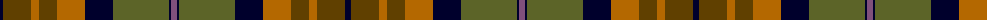

The parent of this is [Dutch Friendship](/tartans/db/6/t28/do8/t18/do28/db28/g28/g28/db2/n/6/)

This was sourced from register-of-tartans.  It is a [10 stripes tartan](/stripes/stripes10/).

Original link https://www.tartanregister.gov.uk/tartanDetails.aspx?ref=1056

## Thread count
DB/6 T28 DO8 T18 DO28 DB28 G28 G28 DB2 N/6

## Palette
Each colour and its ΔE from the base-6 reference it is a variant of.

| Colour | Shade | Base | ΔE (OKLab) |
|---|---|---|---|
| DB |  `#00002C` | K  | 0.16 |
| DO |  `#B46800` | R  | 0.14 |
| G |  `#5C6428` | G  | 0.09 |
| N |  `#80507C` | B  | 0.15 |
| T |  `#604000` | G  | 0.14 |

ID: /variants/db/6/t28/do8/t18/do28/db28/g28/g28/db2/n/6-db00002c-dob46800-g5c6428-n80507c-t604000/
