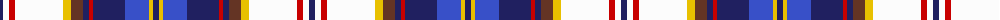

The parent of this is [Lashbrooke of Barrowfield](/tartans/db/6/w6/r6/w48/y8/t12/db6/r4/db32/b24/y4/db/6/)

This was sourced from tartans-authority.  It is a [12 stripes tartan](/stripes/stripes12/).

Original link http://www.tartansauthority.com/tartan-ferret/display/10947/

## Thread count
DB/6 W6 R6 W48 Y8 T12 DB6 R4 DB32 B24 Y4 DB/6

## Palette
Each colour and its ΔE from the base-6 reference it is a variant of.

| Colour | Shade | Base | ΔE (OKLab) |
|---|---|---|---|
| B |  `#3850C8` | B  | 0.12 |
| DB |  `#202060` | B  | 0.11 |
| R |  `#C80000` | R  | 0.00 |
| T |  `#643424` | B  | 0.17 |
| W |  `#FCFCFC` | W  | 0.03 |
| Y |  `#E8C000` | Y  | 0.00 |

ID: /variants/db/6/w6/r6/w48/y8/t12/db6/r4/db32/b24/y4/db/6-b3850c8-db202060-rc80000-t643424-wfcfcfc-ye8c000/
