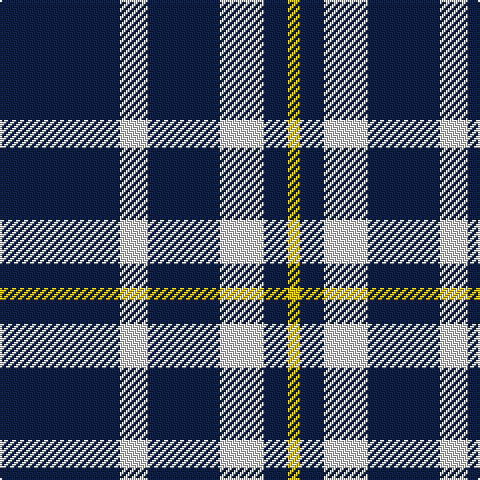

The parent of this is [Ochterlonie](/tartans/db/60/ln14/db36/ln22/db12/y/6/)

This was sourced from weddslist.  It is a [6 stripes tartan](/stripes/stripes6/).

Original link http://www.weddslist.com/cgi-bin/tartans/pg.pl?source=sts

## Thread count
DB/60 LN14 DB36 LN22 DB12 Y/6

## Palette
Each colour and its ΔE from the base-6 reference it is a variant of.

| Colour | Shade | Base | ΔE (OKLab) |
|---|---|---|---|
| DB |  `#102040` | B  | 0.15 |
| LN |  `#E0E0E0` | W  | 0.06 |
| Y |  `#F0C000` | Y  | 0.01 |

# Sample pattern

ID: /variants/db/60/ln14/db36/ln22/db12/y/6-db102040-lne0e0e0-yf0c000/
