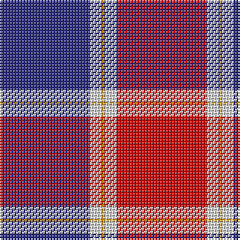

The parent of this is [Philippine Heritage](/tartans/db/60/ln8/dy2/ln8/r/60/)

This was sourced from register-of-tartans.  It is a [5 stripes tartan](/stripes/stripes5/).

Original link https://www.tartanregister.gov.uk/tartanDetails.aspx?ref=10660

## Thread count
DB/60 LN8 DY2 LN8 R/60

## Palette
Each colour and its ΔE from the base-6 reference it is a variant of.

| Colour | Shade | Base | ΔE (OKLab) |
|---|---|---|---|
| DB |  `#2C2C80` | B  | 0.05 |
| DY |  `#C88C00` | Y  | 0.15 |
| LN |  `#E0E0E0` | W  | 0.06 |
| R |  `#C80000` | R  | 0.00 |

# Sample pattern

ID: /variants/db/60/ln8/dy2/ln8/r/60-db2c2c80-dyc88c00-lne0e0e0-rc80000/
