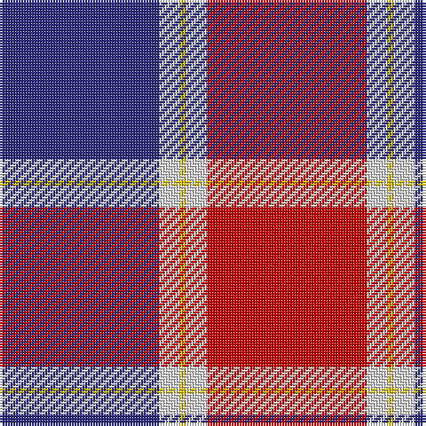

The parent of this is [Philippine Heritage Corporate Tartan Tartan Number: 10660. Earliest known date: 16/07/2012 The colours of this tartan are taken from the flag of the Philippines. Colours: white represents peace and purity; yellow represents independence from Spain; blue represents patriotism and justice; red represents the blood spilt for freedom and independence. Developed for weaving by A Trivett on behalf of the Scottish Tartans Authority. See products available Copyright © Blair Urquhart, Comrie, 2015](/tartans/db/60/ln8/y2/ln8/r/60/)

This was sourced from house-of-tartan.  It is a [5 stripes tartan](/stripes/stripes5/).

Original link http://www.house-of-tartan.scotland.net/house/TartanViewjs.asp?colr=Def&tnam=10660

## Thread count
DB/60 LN8 Y2 LN8 R/60

## Palette
Each colour and its ΔE from the base-6 reference it is a variant of.

| Colour | Shade | Base | ΔE (OKLab) |
|---|---|---|---|
| DB |  `#2C2C80` | B  | 0.05 |
| LN |  `#E0E0E0` | W  | 0.06 |
| R |  `#C80000` | R  | 0.00 |
| Y |  `#E8C000` | Y  | 0.00 |

# Sample pattern

ID: /variants/db/60/ln8/y2/ln8/r/60-db2c2c80-lne0e0e0-rc80000-ye8c000/
